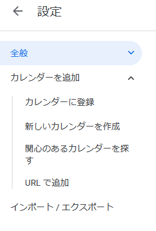

# ウマ娘誕生日カレンダー

## 概要

ウマ娘の誕生日を iCal 形式で配信しています。

- URL : [https://umamusume-birthdays-ical.herokuapp.com](https://umamusume-birthdays-ical.herokuapp.com)

**※非公式です**

ご指摘などあれば Issues を作成するか、下記アカウントまで DM やメンションにてご連絡ください。

- Twitter: [@ushibutatory](https://twitter.com/ushibutatory)

## 自身のカレンダーへの取り込み方法

### Google Calender の場合

1. [設定] - [カレンダーを追加] - [URL で追加]
   
1. 上記 URL を登録します。
   
1. カレンダー名や色、通知などをお好みで変更してください。
   
1. 予定が表示されるまで少し時間がかかる場合があります。

## 備考
