# メモ

## 処理概要



## ローカルでの動作確認（ts-node）

手っ取り早く動作確認する場合はこっち。

### カレンダーデータの更新

```sh
umamusume-birthdays> cd src\app
umamusume-birthdays\src\app> npm run generate
```

※更新した iCal ファイルはコミットしない（gitignore 対象追加済み）

### カレンダーデータの配信

```sh
umamusume-birthdays> cd src\app
umamusume-birthdays\src\app> npm run ts-node ts/server.ts
```

#### 確認用 URL

[http://localhost:8080](http://localhost:8080)

## ローカルでの動作確認（Docker）

本番に近い条件で動作確認する場合はこっち。

### Docker イメージのビルド

```sh
umamusume-birthdays> docker build -t ushibutatory/umamusume-birthdays .
```

### コンテナ起動

ポート番号はお好みでよい。

```sh
umamusume-birthdays> docker run -p 49160:8080 -d ushibutatory/umamusume-birthdays
```

#### 確認用 URL

[http://localhost:49160](http://localhost:49160)
